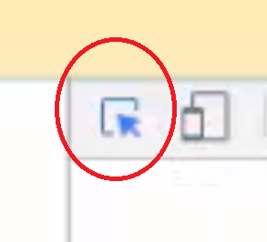

## Gmail automation with selenium


### Prior requirements:
```
- [ ] Install selenium
- [ ] Install Google Chrome browser
- [ ] Download Selenium Chrome Driver according to your Chrome version [here](https://sites.google.com/a/chromium.org/chromedriver/downloads)
- [ ] Download the ZIP file, extract Chromedriver.exe executable and place the your C:\Python\Scripts
```
###### *Selenium will allow us to scroll/copy text/fill forms and click buttons and Selenium Chrome Driver will open for us Google Chrome to perform our automated tasks .*

### Explaining the code:
###### Logging in with our email by using HTML attributes 

```
    username = browser.find_element_by_id('identifierId')  #log in with email
    username.send_keys(usernameStr) #simulates keypresses in the desired element
    nextButton = browser.find_element_by_id('identifierNext') #press next
    nextButton.click() #simulates a mouse click.
```

We need to find the input fields on the web page so we can enter our email and password.

- [ ] Use the built-in Chrome Developer Tools
- [ ] We only need to right-click on the input fields, and select the “Inspect” menu
###### *Then click on this sign:

###### and point on where the user insert his email .*

-[ ] finally, right-click the relevent field->copy->copy Xpath
###### *it will look like this:*


-[ ] you will recieve this kind of text - "//*[@id="identifierId"]"
###### *In the code above, we are searching for the username input field by id, and filling it with the desired text 'identifierId'.*


###### I did the same exact process for Password and next button

#### Hope you find my explanation clear.
### Now let's run the code ✔


